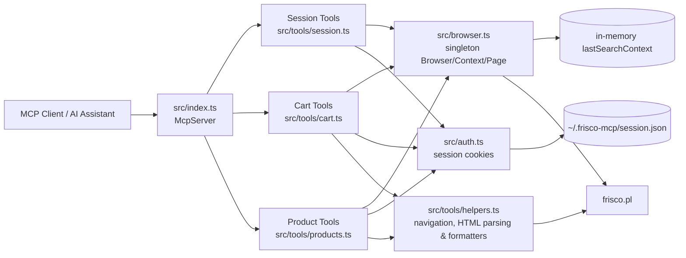
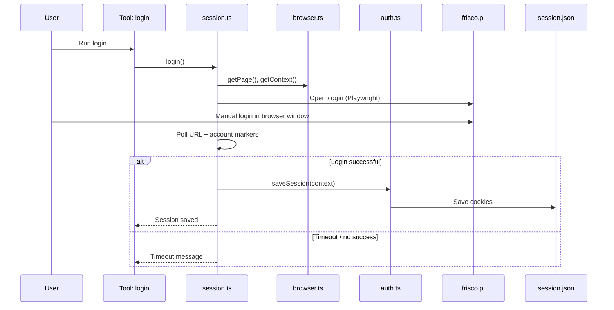
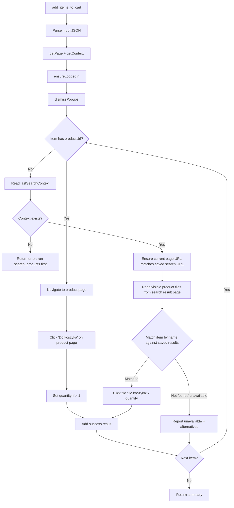
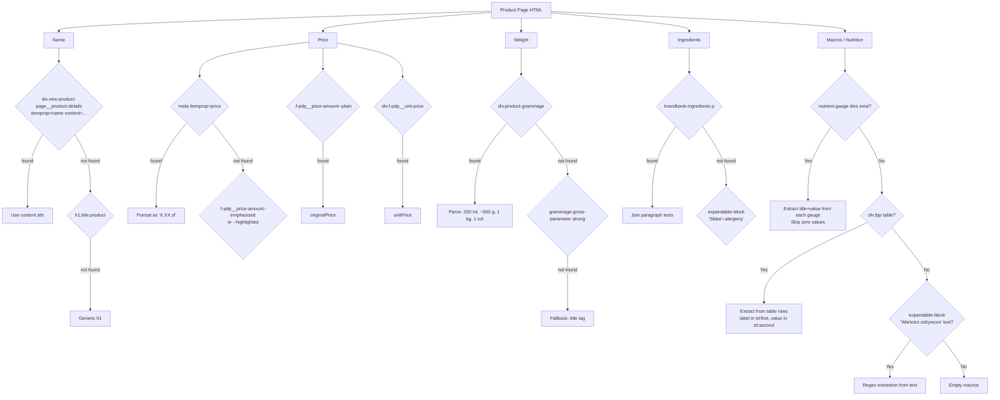

# Frisco MCP Solution Diagrams

Below are diagrams of the key project components: architecture, session/login flow, and the flow for adding products to the cart.

## 1) High-Level Architecture

### Registered Tools

| Tool | Module | Description |
|------|--------|-------------|
| `login` | session.ts | Open browser for manual login |
| `finish_session` | session.ts | Open checkout page |
| `clear_session` | session.ts | Clear session and close browser |
| `search_products` | products.ts | Search products + save search URL/context |
| `get_product_info` | products.ts | Detailed product info (macros, ingredients) |
| `get_product_reviews` | products.ts | Customer reviews and ratings (Trustmate) |
| `add_items_to_cart` | cart.ts | Add products via productUrl (preferred) or from search results |
| `view_cart` | cart.ts | View current cart contents |
| `remove_item_from_cart` | cart.ts | Remove a product from cart |
| `update_item_quantity` | cart.ts | Change quantity of a product in cart |
| `check_cart_issues` | cart.ts | Detect sold-out items and list substitutes |
| `view_promotions` | cart.ts | Show active promotions and savings |
| `get_logs` | logger.ts | Read session log events |
| `tail_logs` | logger.ts | Read recent log events |

## 2) Login and Session Flow

## 3) Add Products to Cart Flow

## 4) Product Page HTML Parsing

`extractProductPageInfoFromHtml` in `helpers.ts` extracts structured data from frisco.pl product pages. The parser handles different product types: food with full nutrition, food with partial/no nutrition, non-food items, and promotional products.

### Product types vs. extracted data

| Product type | Example | Weight | Macros | Ingredients | Original price |
|---|---|---|---|---|---|
| Dairy (full nutrition) | Skyr, Mascarpone | ml / g | Full (gauge) | Sometimes | If on promotion |
| Meat (table format) | Chicken filet | ~g (approx) | Table (may be empty) | brandbank | No |
| Fruit | Bananas | ~kg (approx) | Partial (gauge) | No | No |
| Eggs (by piece) | Free-range eggs | szt | No | No | No |
| Non-food | Trash bags | szt | Zeroes → empty | No | No |
