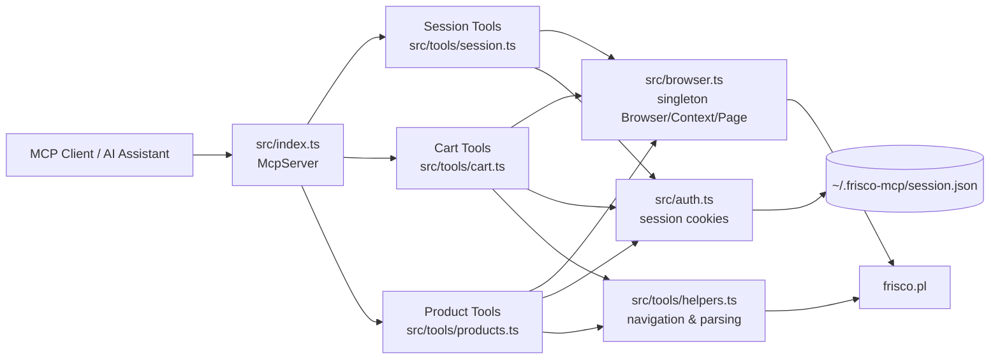
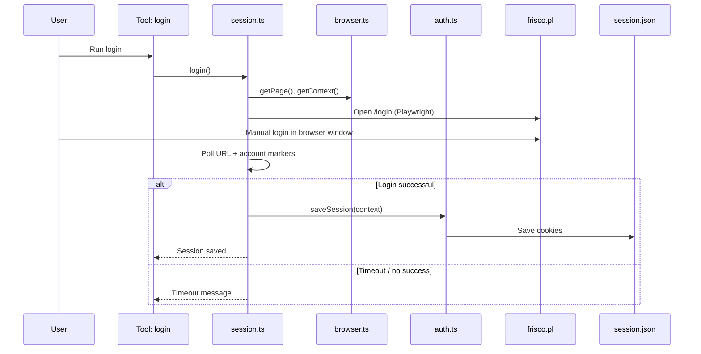

# Frisco MCP Solution Diagrams

Below are diagrams of the key project components: architecture, session/login flow, and the flow for adding products to the cart.

## 1) High-Level Architecture



## 2) Login and Session Flow



## 3) Add Products to Cart Flow

```mermaid
flowchart TD
    A[add_items_to_cart] --> B[Parse input JSON]
    B --> C[getPage + getContext]
    C --> D[ensureLoggedIn]
    D --> E[dismissPopups]
    E --> F[clearCart]
    F --> G{For each product}

    G --> H[searchNavigateAndCache(query)]
    H --> I{Found 'Add to cart'<br/>button?}
    I -- No --> J[Add warning result]
    I -- Yes --> K[Click 'Add to cart' x quantity]
    K --> L[Add success result]
    J --> M{Next product?}
    L --> M
    M -- Yes --> G
    M -- No --> N[Return summary]
```
